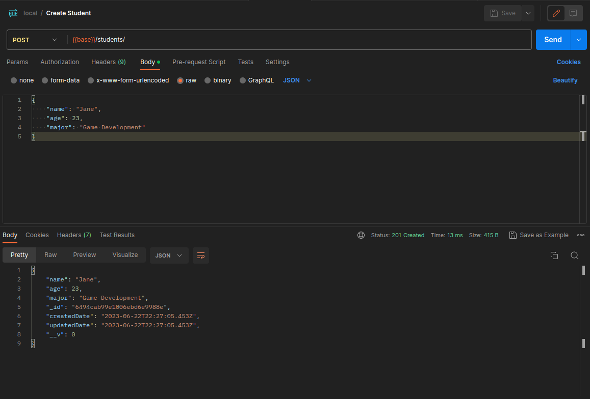
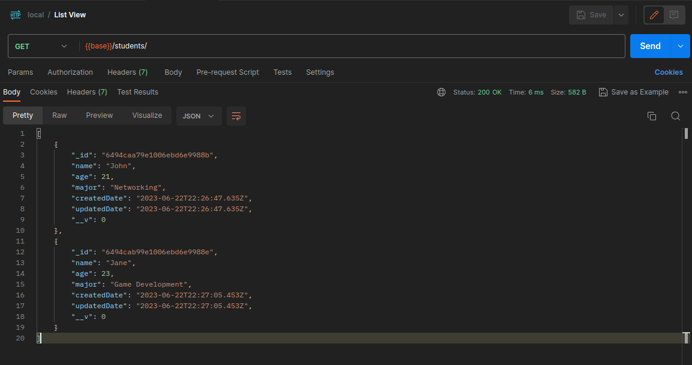
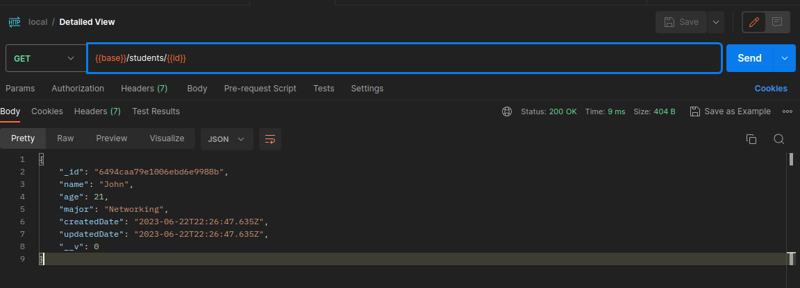
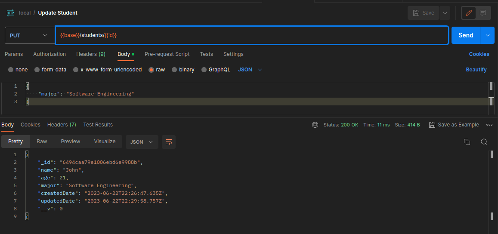
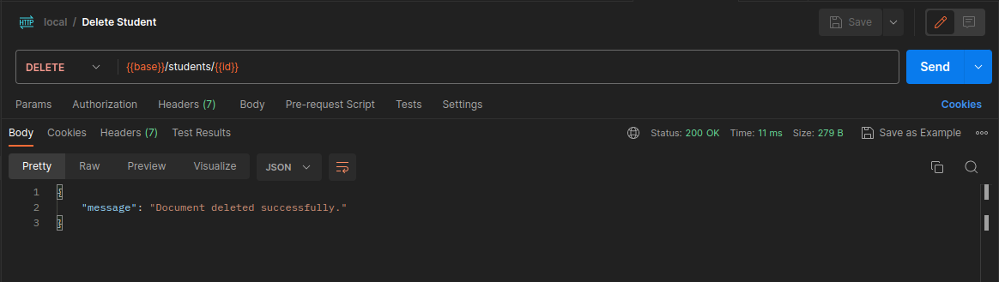

# Student Information API System

> Note: You can download the postman collection from the repo but if you are using any other API clients you should be fine.

First thing you want to do is to create a new student via the `/students/` endpoint:

> Note: You might want to make more than one students for having a better experience with the list view

After making your students you can list them via the same endpoint but by sending a `GET` request.

You can have the detailed view via appending the student ID to the endpoint.

You can update and delete the student in the same way.

